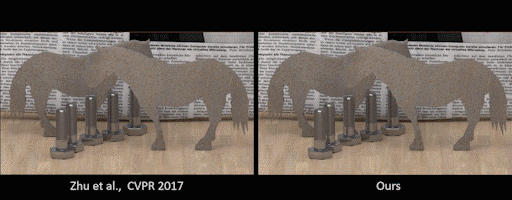

# View-Consistent 4D Light Field Superpixel Segmentation
 [Numair Khan](https://cs.brown.edu/~nkhan6)<sup>1</sup>, 
 [Qian Zhang](https://qianzhanginfo.github.io/)<sup>1</sup>, 
 Lucas Kasser<sup>1</sup>,Henry Stone<sup>1</sup>,
 [Min H. Kim](http://vclab.kaist.ac.kr/minhkim/)<sup>2</sup>,
 [James Tompkin](https://jamestompkin.com)<sup>1</sup><br>
 <sup>1</sup>Brown, <sup>2</sup>KAIST 
 In ICCV 2019

[](https://youtu.be/xO2DW7N2GdE)

### MATLAB Code | [Paper](https://cs.brown.edu/~nkhan6/docs/khan_iccv19.pdf) | [Supplemental](https://cs.brown.edu/~nkhan6/docs/khan_iccv19_supplemental.pdf) | [Results Video](https://www.youtube.com/watch?v=s2EVBgeo40Y) | [Presentation Video](https://youtu.be/xO2DW7N2GdE)

## Citation
If you use this code in your work, please cite our paper,

```
@article{khan2019vclfs,
  title={View-consistent 4D Lightfield Superpixel Segmentation},
  author={Numair Khan, Qian Zhang, Lucas Kasser, Henry Stone, Min H. Kim, James Tompkin},
  journal={International Conference on Computer Vision},
  year={2019},
}
```

## Running the Code
* [Generating superpixels](#generating-superpixels)
* [Comparing your own results on the HCI dataset](#comparing-results-hci)
* [Comparing your own results on other datasets](#comparing-results)
* [Troubleshooting](#troubleshooting)

### Generating Superpixels
To generate a superpixel segmentation of a light field, use `run.sh` followed by the path to the light field file:

``` sudo ./run.sh <path-to-light-field> ```

The light field is provided as a `.mat` file containing a 5D array. The dimensions of the 5D array should be ordered as (y, x, rgb, v, u) where "rgb" denotes the color channels. 

```
                 u              
       ---------------------------->
       |  ________    ________
       | |    x   |  |    x   |
       | |        |  |        |
     v | | y      |  | y      | ....
       | |        |  |        |     
       | |________|  |________| 
       |           :
       |           :
       v
```

Alternatively, a path to a directory of images may be provided to `run.sh`. The directory should contain a file called `config.txt` with the dimensions of the light field on the first line in format `y, x, v, u`.

Make sure to set the camera movement direction for both u and v in `parameters.m`.

The segmentation results are output to a 4D MATLAB array in `./results/<time-stamp>/`.

### Comparing Your Own Results on the HCI dataset
It's easy to compare results of your own light field superpixel algorithm to our method on the old HCI dataset. Since the old HCI dataset provides ground truth segmentation labels and disparity maps, we can evaluate results both quantitatively and qualitatively.

To do this, first download and extract the [dataset](https://cs.brown.edu) to a location on your file `<path-to-hci-dataset>`. Then run:

``` sudo ./compare-hci.sh <path-to-your-results> <path-to-output-plots> <path-to-hci-dataset> ```

This will output qualitative and quantitative comparison figures at location `<path-to-output-plots>`. This takes some time to finish, so you may want to run it overnight.

`<path-to-your-results>` should contain your results stored as 4D arrays in separate `.mat` files, with the following considerations: 

- The filename of each `.mat` file should contain the name of the HCI light field it stores labels for (`buddha`, `horses`, `papillon`, or `stillLife` -- casing doesn't matter). 

- Provide separate files for each superpixel size. 

- Make sure your 4D arrays follow the dimensional order `(y, x, v, u)`

### Comparing your own results on other datasets
For datasets other than the old HCI, we can only do qualitative comparison. See the function `eval/plotComparisonQualitative.m` for doing this from MATLAB.

### Troubleshooting
- Code fails with error `Index exceeds the number of array elements`: Make sure you are following the correct dimensional
ordering; for light field images this should be `(y, x, rgb, v, u)` and for superpixel labels `(y, x, v, u)`.
- The segmentation output has very high error: Make sure you specify the direction in which the camera moves in u and v. This can be done by setting the boolean variables `uCamMovingRight` and `vCamMovingRight` in `parameters.m`. The camera movement direction determines the occlusion order of EPI lines, and is important for the bipartite matching stage of our algorithm.
- The code has been run and tested in MATLAB 2019a. Older version of MATLAB may throw errors on some functions.

## Errata 

- In Figure 8, the central row of the EPFL light fields show view(4, 4), rather than view(5, 5)
- The manner in which labels are propagated has been updated. Before we were beginning at the top-most view in the central column, and moving down. Now we move out from the central view in a spiral. This leads to a slight improvement over the results reported in the paper.

